# Overview

Home for Dynamics AX 2012 desktop client test cases.

- Reusable functions are defined in `User.js`.
- Data for each test case is defined in `Data.xlsx`.
- `Dropdowns.xlsx` contains lists of values for [RVL dropdowns](https://rapisedoc.inflectra.com/Guide/rvl_editor/#param-dropdowns).
- `Output.xlsx` is used to persist data between test executions (see SetOutputValue, GetOutputValue common functions below).

The way of test parameterization and reading data from an Excel spreadsheet is described in the docs:

[Data-Driven Testing](https://rapisedoc.inflectra.com/Guide/ddt/)

## Common Functions

All functions are defined in `User.js`. Look into this file for details.

### DaxLaunch

Launches Dynamics AX desktop client and waits for it to show up on screen.

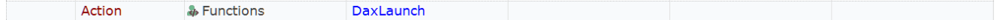

### DaxLaunchWithConfig

Launches Dynamics AX desktop client using a given Dynamics Configuration File.

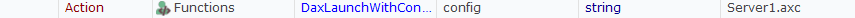

### DaxClose

Closes Dynamics AX desktop client.

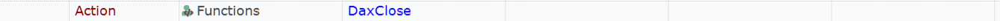

### DaxChangeCompany

Changes current company.

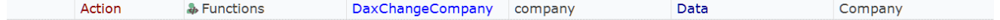

Opens `Select company` dialog and chooses a company from the list.

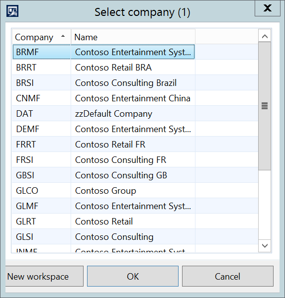

### DaxOpenModule

Makes sure that given module is enabled. Use it before doing navigation in the address bar.

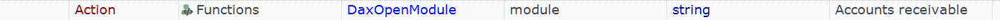

Opens Navigation Pane Options dialog and sets the checkbox near given module.

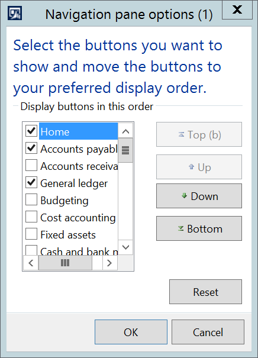

### DaxNavigate

Navigates to a specific page using the address bar.

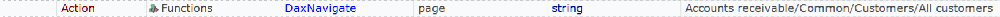

This function clicks in the address area, enters a page address and hits enter key.

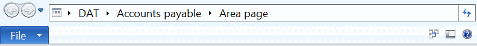

### DaxSelectFastTab

Selects Fast Tab with a given name.

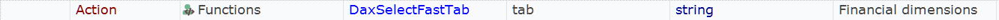

This function expands a given tab and scrolls to it if necessary.

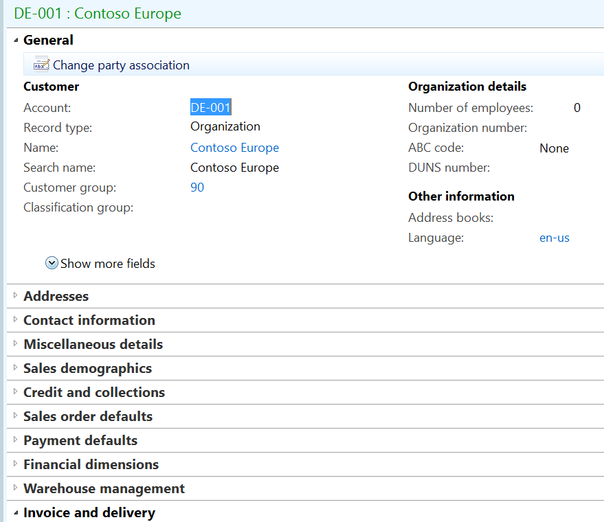

### DaxFilterGrid

Applies a filter to table data.

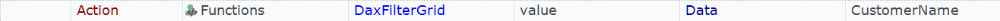

This function enters a filter value, then selects a field for filtering and clicks the filter button.

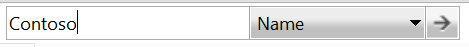

### DaxOpenDropdown

Clicks at the right part of an object. Use it to expand dropdowns.

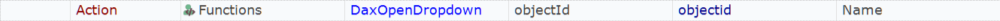

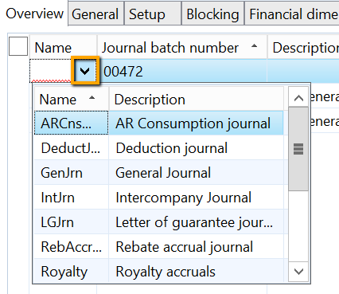

### DaxClickCell

Clicks into a cell of a grid until placeholder object appears. Sometimes DAX ignores single clicks, this function makes sure that a click goes through.

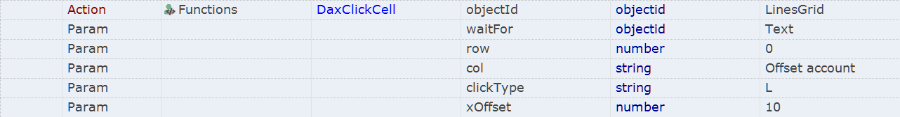

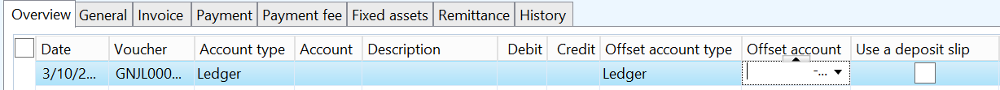

### DaxChooseFile

Enters file name and clicks Open button in Attach File dialog.

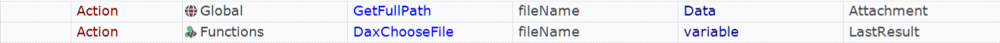

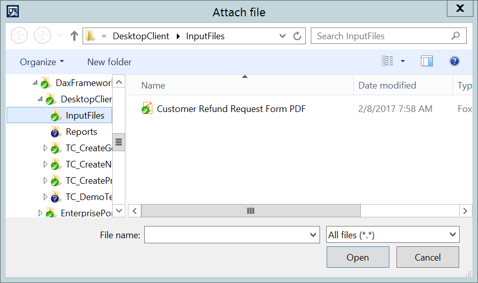

### SetOutputValue

Writes key/value pair to Output.xlsx

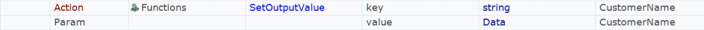

### GetOutputValue

Reads value from Output.xlsx

