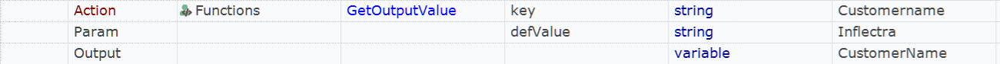

# Overview

Home for Dynamics AX 2012 desktop client test cases.

- Reusable functions are defined in `User.js`.
- Data for each test case is defined in `Data.xlsx`.
- `Dropdowns.xlsx` contains lists of values for RVL dropdowns.
- `Output.xlsx` is used to persist data between test executions.

The way of test parameterization and reading data from an Excel spreadsheet is described in the docs:

[Data-Driven Testing](https://rapisedoc.inflectra.com/Guide/ddt/)

## Common Functions

All functions are defined in `User.js`. Look into this file for details.

### DaxLaunch

Launches Dynamics AX desktop client and waits for it to show up on screen.

### DaxClose

Closes Dynamics AX desktop client.

### DaxChangeCompany

Changes current company.

Open `Select company` dialog and chooses a company from the list.

### DaxOpenModule

Makes sure that given module is enabled. Use it before doing navigation in the address bar.

Opens Navigation Pane Options dialog and sets the checkbox near given module.

### DaxNavigate

Navigates to a specific page using the address bar.

This function clicks in the address area, enters a page address and hits enter key.

### DaxSelectFastTab

Selects Fast Tab with a given name.

This function expands a given tab and scrolls to it if necessary.

### DaxFilterGrid

Applies a filter to table data.

This function enters a filter value, then selects a field for filtering and clicks the filter button.

### DaxOpenDropdown

Clicks at the right part of an object. Use it to expand dropdowns.

### DaxClickCell

Clicks into a cell of a grid until placeholder object appears. Sometimes DAX ignores single clicks, this function makes sure that a click goes through.

### DaxChooseFile

Enters file name and clicks Open button in Attach File dialog.

### SetOutputValue

Writes key/value pair to Output.xlsx

### GetOutputValue

Reads value from Output.xlsx

