# Overview

Home for Enterprise Portal test cases.

- Reusable functions are defined in `User.js`.
- Data for each test case is defined in `Data.xlsx`.
- `Dropdowns.xlsx` contains lists of values for RVL dropdowns.
- `Output.xlsx` is used to persist data between test executions.

The way of test parameterization and reading data from an Excel spreadsheet is described in the docs:

[Data-Driven Testing](https://rapisedoc.inflectra.com/Guide/ddt/)

## Common Functions

All functions are defined in `User.js`. Look into this file for details.

### EpLaunch

Launches `Enterprise Portal` in a browser. `EnterprisePortalUrl`, `UserName`, `Password` must be set in `Config.xlsx`.

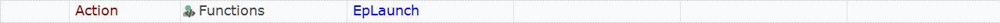

### EsLaunch

Launches `Enterprise Portal > Employee Services` in a browser. `EmployeeServicesUrl`, `UserName`, `Password` must be set in `Config.xlsx`.

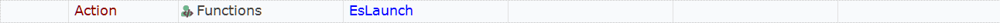

### EpChangeCompany

Changes current company.

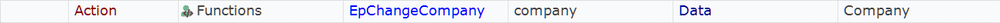

Opens the dropdown with the list of companies and selects a given company.

### EsOpenModule

Navigates to specified module in Employee Services.

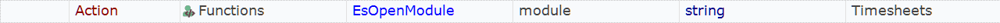

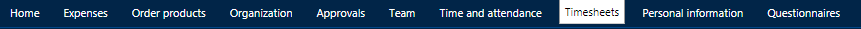

### EpOpenModule

Navigates to specified module in Enterprise Portal.

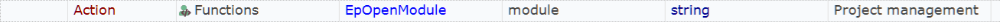

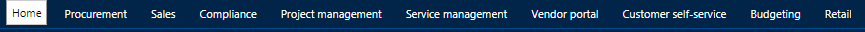

### EpSelectTab

Selects top level tab in current module.

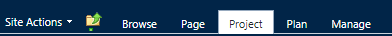

### EpClickRibbon

Clicks a button on the ribbon.

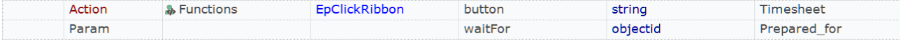

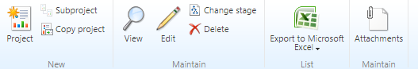

### EpFilterGrid

Applies a filter to table data.

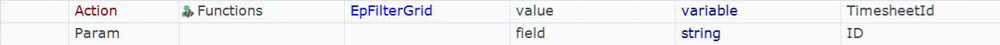

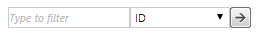

### EpSelectFastTab

Selects Fast Tab.

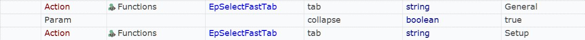

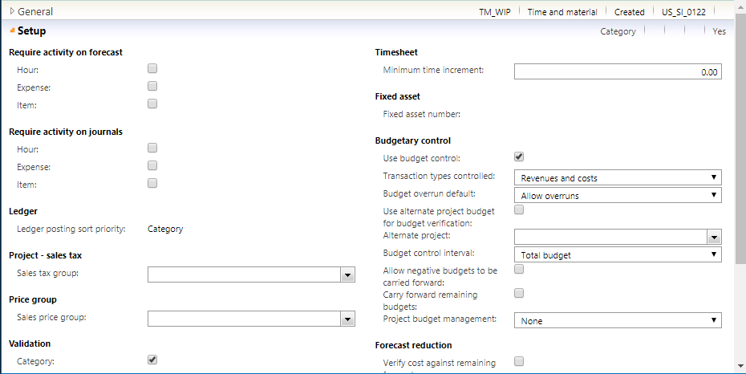

### SetOutputValue

Writes key/value pair to Output.xlsx

### GetOutputValue

Reads value from Output.xlsx

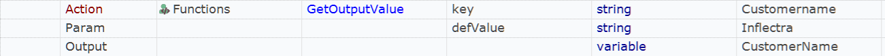

